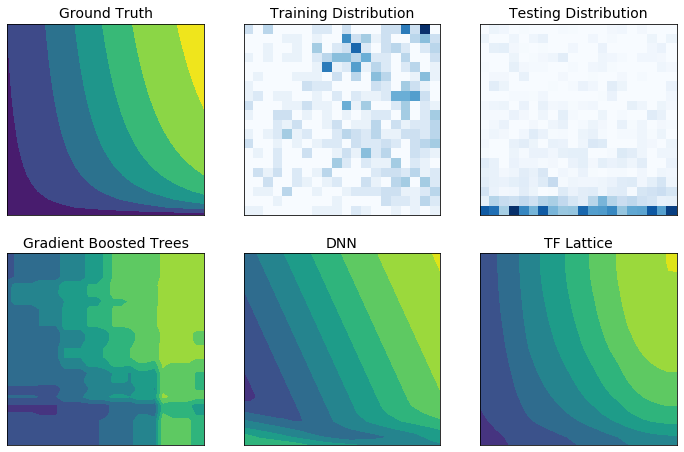

<!-- Copyright 2020 The TensorFlow Lattice Authors.

Licensed under the Apache License, Version 2.0 (the "License");
you may not use this file except in compliance with the License.
You may obtain a copy of the License at

     http://www.apache.org/licenses/LICENSE-2.0

Unless required by applicable law or agreed to in writing, software
distributed under the License is distributed on an "AS IS" BASIS,
WITHOUT WARRANTIES OR CONDITIONS OF ANY KIND, either express or implied.
See the License for the specific language governing permissions and
limitations under the License.
=============================================================================-->
# TensorFlow Lattice

TensorFlow Lattice is a library that implements constrained and interpretable
lattice based models. It is an implementation of
[Monotonic Calibrated Interpolated Look-Up Tables](http://jmlr.org/papers/v17/15-243.html)
in [TensorFlow](https://www.tensorflow.org).

The library enables you to inject domain knowledge into
the learning process through common-sense or policy-driven shape constraints.
This is done using a collection of Keras layers that can satisfy constraints
such as monotonicity, convexity and pairwise trust:

* PWLCalibration: piecewise linear calibration of signals.
* CategoricalCalibration: mapping of categorical inputs into real values.
* Lattice: interpolated look-up table implementation.
* Linear: linear function with monotonicity and norm constraints.

The library also provides easy to setup canned estimators for common use cases:

* Calibrated Linear
* Calibrated Lattice
* Random Tiny Lattices (RTL)
* Crystals

With TF Lattice you can use domain knowledge to better extrapolate to the parts
of the input space not covered by the training dataset. This helps avoid
unexpected model behaviour when the serving distribution is different from the
training distribution.

<div align="center">
  
</div>

You can install our prebuilt pip package using

```bash
pip install tensorflow-lattice
```
