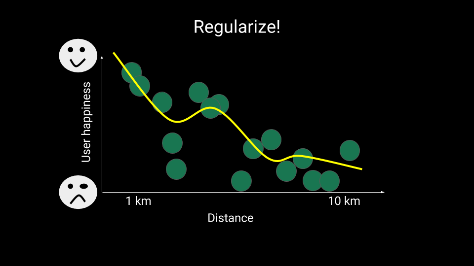
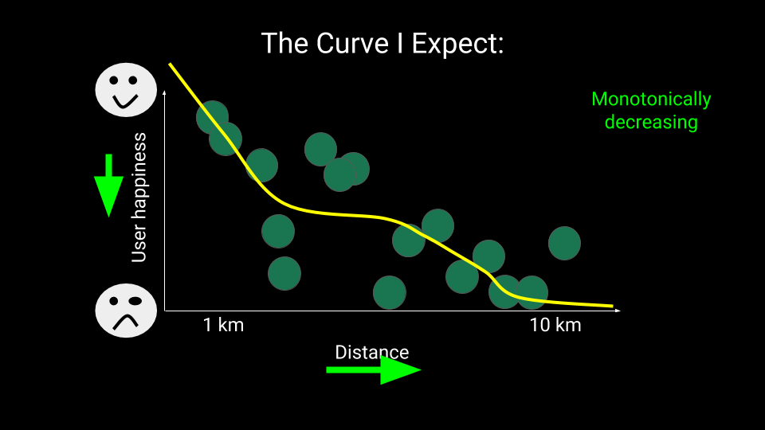

<!-- DO NOT EDIT! Automatically generated file. -->
# TensorFlow Lattice: Lattice modeling in TensorFlow

__TensorFlow Lattice__ is a library that implements lattice based models which
are fast-to-evaluate and interpretable (optionally monotonic) models, also known
as __interpolated look-up tables__. It includes a collection of [TensorFlow
Lattice Estimators](#tensorflow-lattice-estimators-walk-through), which you can
use like any [TensorFlow
Estimator](https://www.tensorflow.org/programmers_guide/estimators), and it also
includes lattices and piecewise linear calibration as layers that can be
composed into custom models.

Note that __TensorFlow Lattice is not an official Google product__.

[TOC]

--------------------------------------------------------------------------------

## Concepts

This section is a simplified version of the description in [Monotonic Calibrated
Interpolated Look-Up Tables](http://jmlr.org/papers/v17/15-243.html))

### Lattices

A __lattice__ is an interpolated look-up table that can approximate arbitrary
input-output relationships in your data. It overlaps a regular grid on your
input space, and it learns values for the output in the vertices of the grid.
For a test point $$x$$, $$f(x)$$ is linearly interpolated from the lattice
values surrounding $$x$$.


The above simple example is a function with just 2 features, and has 4
parameters: 0, 0.2, 0.4, and 1, which are the function's values at the corners
of the input space; the rest of the function is interpolated from these
parameters.

The function $$f(x)$$ can capture non-linear interactions between features. You
can think of the lattice parameters as the height of poles set in the ground on
a regular grid, and the resulting function is like cloth pulled tight against
the four poles.

With $$D$$ features, a regular lattice will have $$2^D$$ parameters. To fit a
more flexible function, you can specify a finer-grained lattice over the feature
space. Combined with an efficient $$O(D log(D))$$ interpolation, lattice
regression gives you __fast evaluation times__ and __arbitrarily complex
functions__.

Lattice regression functions are continuous, and piecewise infinitely
differentiable, but they are generally not analytically differentiable at the
lattice vertices themselves. Still, they tend to be __very smooth__.

### Calibration

Let's say the preceding sample lattice represents a learned *user happiness*
with a suggestion of a coffee shop. Furthermore, assume the following:

*   *feature 1* is a baseline coffee price.
*   *feature 2* is the distance to a local coffee shop.

We want our model to learn user happiness with a coffee shop suggestion. The
distance can be defined from 0km to 30km and baseline coffee price can be
something from $0 to $20.

TensorFlow Lattice models use __piecewise linear functions__ to calibrate (or
_normalize_) your input features to the range accepted by the lattice: from
$$0.0$$ to $$1.0$$ in the example lattice above.

The following diagrams show examples of what could be the calibration of the
price and baseline coffee price using 10 keypoints each:

<div style="width:100%;"><center><nobr>


</nobr></center></div>

All TensorFlow Lattice pre-made models (`Estimator`'s) use calibration of the
features: the input (the $$x$$ axis of the plot above) is set to the quantiles
(so data will be +/- evenly distributed on the keypoints), and the output ($$y$$
axis) is learned along with the lattice(s).

Notice that the calibration also handles the negative correlation of distance
and _user happiness_.

### Ensembles

If you have $$D$$ features in a lattice, the number of parameters (vertices) of
the lattice will be at least $$2^D$$. (To be precise replace 2s with the size of
the grid for each feature.) As you can see lattices don't scale well with the
number of features.

TensorFlow Lattice offers ensembles of lattices to overcome this limitation.
That is, several "tiny" lattices are combined (summed), enabling the model to
grow linearly on the number of features, albeit exponential on the number of
features in each of these "tiny" lattices, but the number of features per
lattice are typically configured to be small.

The library provide two variations of these ensembles:

*   __Random Tiny Lattices__ (__RTL__ for short): an arbitrary number of
    lattices of dimension $$D_l$$, each including random $$D_l$$ features out of
    the total $$D$$ input features.

*   __Ensembled Tiny Lattices__ (__ETL__ for short): As with RTLs, an arbitrary
    number of lattices of dimension $$D_l$$ is selected, but the input for these
    lattices are linear combinations (initialized randomly) of all the $$D$$
    inputs. It is more flexible than *RTL*, but less interpretable and may take
    longer to train.

--------------------------------------------------------------------------------

## Why TensorFlow Lattice ?

You can find a brief introduction to TensorFlow Lattice in [Google's Research
Blog post](https://research.googleblog.com/).

*   __Interpretability__: the parameters of the model are the output at the
    vertices.

*   Powerful: __abritrarily complex__ functions with __fast evaluation times__
    (in comparison to some equivalent Deep Neural Networks for instance).

As shown in the following figure, in real world usage, the training data is
often a somewhat biased representation of where the model will be applied:


TensorFlow Lattice provides the following types of __"semantic
regularization"__:

*   Lattice resolution: the number of vertices in your lattice allow control
    over the flexibility of the functions that can be learned.

*   __Monotonicity__: You can specify that the output should only
    increase/decrease with respect to an input. In our example, you may want to
    specify that increased distance to a coffee shop should only decrease the
    chances of the coffee shop being a good one. (See the illustration below.)

*   __Graph Laplacian__: Outputs of the lattice/calibration vertices/keypoints
    are regularized torwards the values of their respective neighbors. So
    corners (vertices) of the space that sees less training data will fit snugly
    with the neighbors.

*   __Torsion__: Outputs of the lattice will be regularized towards preventing
    torsion among the features. In other words, the model will be regularized
    towards the contributions of the features being independent of each other.

<table style="vertical-align:middle; text-align:center; border-collapse:collapse;">
<tr>
<td style="border:none"></td>
<td style="border:none"></td>
<tr>
<td style="border:none"></td>
<td style="border:none"></td>
</tr>
</table>

--------------------------------------------------------------------------------

## TensorFlow Lattice Estimators Walk-through

TensorFlow Lattice library provides generic models formatted as pre-made
[estimators](https://www.tensorflow.org/programmers_guide/estimators), which we
hope will cover the typical use cases, or serve as example for those creating
their own models.

This section provides a walk-through of how to use the pre-made estimators to
train a classifier of [Census income
dataset](https://archive.ics.uci.edu/ml/datasets/Census+Income) using TensorFlow
Lattice. The full code used in this section, which includes some more details,
is in
[examples/uci_census.py](https://github.com/tensorflow/lattice/blob/master/examples/uci_census.py).

If you have trouble with the 'tf.estimator' interface, consider going over the
[TensorFlow Linear Model Tutorial](https://www.tensorflow.org/tutorials/wide).
All of the data parsing and formatting is very similar.

### UCI Census Income Dataset

For this walk-through, we will use the [UCI Census Income
Dataset](https://archive.ics.uci.edu/ml/datasets/Census+Income). You can
download the CSV train and test files directly from these links:

*   [adult.data](https://archive.ics.uci.edu/ml/machine-learning-databases/adult/adult.data)
*   [adult.test](https://archive.ics.uci.edu/ml/machine-learning-databases/adult/adult.test)

Please save the datasets into a temporary directory (for example,
`/tmp/uci_census`) and change the `--test` and `--train` flags to point to the
files when running the code that follows.

The data is available as CSV, and we use [pandas data analysis
library](http://pandas.pydata.org/) (`pip install pandas` on most platforms,
maybe requiring `sudo`) to make the parsing easy.

The `tf.estimator` models use an input builder function, usually named
`input_fn` which is reponsible to parse data and convert into `tf.Tensor`s (or
`tf.SparseTensor`s) with batches of data.

Our `input_fn` functions look like the following:

```python
import pandas as pd
import tensorflow as tf
import tensorflow_lattice as tfl

flags = tf.flags
FLAGS = flags.FLAGS

flags.DEFINE_string("test", "/tmp/uci_census/adult.test", "Path to test file.")
flags.DEFINE_string("train", "/tmp/uci_census/adult.data", "Path to train file.")

CSV_COLUMNS = [
    "age", "workclass", "fnlwgt", "education", "education_num",
    "marital_status", "occupation", "relationship", "race", "gender",
    "capital_gain", "capital_loss", "hours_per_week", "native_country",
    "income_bracket"
]

def get_test_input_fn(batch_size, num_epochs, shuffle):
  return get_input_fn(FLAGS.test, batch_size, num_epochs, shuffle)


def get_train_input_fn(batch_size, num_epochs, shuffle):
  return get_input_fn(FLAGS.train, batch_size, num_epochs, shuffle)


def get_input_fn(file_path, batch_size, num_epochs, shuffle):
  df_data = pd.read_csv(
      tf.gfile.Open(file_path),
      names=CSV_COLUMNS,
      skipinitialspace=True,
      engine="python",
      skiprows=1)
  df_data = df_data.dropna(how="any", axis=0)
  labels = df_data["income_bracket"].apply(lambda x: ">50K" in x).astype(int)
  return tf.estimator.inputs.pandas_input_fn(
      x=df_data,
      y=labels,
      batch_size=batch_size,
      shuffle=shuffle,
      num_epochs=num_epochs,
      num_threads=1)
```

### Preparing `FeatureColumns`

TensorFlow provides `FeatureColumn`s as a way to select and describe the
features used for a model. Numeric features require no transformations; we need
to list the known valid values of categorical features.

See more details in [TensorFlow Linear Model
tutorial](https://www.tensorflow.org/tutorials/wide).

TensorFlow Lattice pre-made estimators will take any of the currently supported
`FeatureColumns` or alternatively the raw columns coming from the `input_fn`
function, if they are properly numeric already.

```python
def get_feature_columns():
  # Categorical features.
  gender =
      tf.feature_column.categorical_column_with_vocabulary_list(
          "gender", ["Female", "Male"])
  education =
      tf.feature_column.categorical_column_with_vocabulary_list(
          "education", [
              "Bachelors", "HS-grad", "11th", "Masters", "9th", "Some-college",
              "Assoc-acdm", "Assoc-voc", "7th-8th", "Doctorate", "Prof-school",
              "5th-6th", "10th", "1st-4th", "Preschool", "12th"
          ])
  …
  # Numerical (continuous) base columns.
  age = tf.feature_column.numeric_column("age")
  education_num = tf.feature_column.numeric_column("education_num")
  capital_gain = tf.feature_column.numeric_column("capital_gain")
  …
  return [
      age,
      workclass,
      education,
      education_num,
      marital_status,
      occupation,
      relationship,
      race,
      gender,
      capital_gain,
      capital_loss,
      hours_per_week,
      native_country,
  ]

```

Note: unlike DNN pre-made estimators
([DNNClassifier](https://www.tensorflow.org/versions/r1.3/api_docs/python/tf/estimator/DNNClassifier)
and
[DNNRegressor](https://www.tensorflow.org/versions/r1.3/api_docs/python/tf/estimator/DNNClassifier)),
TensorFlow Lattice pre-made estimators accept sparse `FeatureColumn` without the
need for embedding them.

### Calibration: Saving The Quantiles

TensorFlow Lattice requires proper calibration of the input for its lattices
(see section on [calibration](#calibration) above).

The current default calibration algorithm requires quantiles information about
the data on which it's going to train. This can be done as a simple
pre-processing step.

The following code snippet from our example does that:

```python
import tensorflow_lattice as tfl

flags.DEFINE_bool("create_quantiles", False,
                  "Run once to create histogram of features for calibration.")
flags.DEFINE_string(
    "quantiles_dir", None,
    "Directory where to store quantile information, defaults to the model "
    "directory (set by --output-dir) but since quantiles can be reused by "
    "models with different parameters, you may want to have a separate "
    "directory.")
…

def create_quantiles(quantiles_dir):
  """Creates quantiles directory if it doesn't yet exist."""
  batch_size = 10000
  input_fn = get_test_input_fn(
      batch_size=batch_size, num_epochs=1, shuffle=False)
  # Reads until input is exhausted, 10000 at a time.
  tfl.save_quantiles_for_keypoints(
      input_fn=input_fn,
      save_dir=quantiles_dir,
      feature_columns=create_feature_columns(),
      num_steps=None)

def main(argv)
  …

  # Create quantiles if required.
  if FLAGS.create_quantiles:
    if FLAGS.run != "train":
      raise ValueError(
          "Can not create_quantiles for mode --run='{}'".format(FLAGS.run))
    create_quantiles(quantiles_dir)
```

Note: This only needs to be run once per dataset, and can be shared among
different models that use the same data.

Note: This information is only needed for training. During inference
(production), the model itself already contains all the information it needs,
and doesn't need to read this anymore.

Advanced: If you know the range of input, instead of using quantiles, you can
provide
[`uniform_keypoints_for_signal`](../api_docs/python/tensorflow_lattice/uniform_keypoints_for_signal.md)
as function initializer, which will create calibration keypoints uniformly in
the given range. Or you can provide your own keypoint initializing function.

### Calibrated Linear Model

Calibrated linear model is the simplest model type offered in TensorFlow
Lattice. It calibrates the input using piecewise-linear calibrated functions and
then linearly combine the inputs. Using it is trivial, if you are used to
TensorFlow's `Estimator` framework (see [Module
tf.estimator](https://www.tensorflow.org/api_docs/python/tf/estimator)).

To create a calibrated linear model, you need to specify features in
`feature_columns`, the model directory in `model_dir`, the ["run
configuration"](https://www.tensorflow.org/api_docs/python/tf/estimator/RunConfig)
in `config`, and in `hparams` the hyperparameters settings in the form of a
[`tfl.CalibratedLinearHParams`](../api_docs/python/tensorflow_lattice/CalibratedLinearHParams.md)
object.

All parameters are optional; see more details in:

*   [`tfl.calibrated_linear_classifier`](../api_docs/python/tensorflow_lattice/calibrated_linear_classifier.md)
*   [`tfl.calibrated_linear_regressor`](../api_docs/python/tensorflow_lattice/calibrated_linear_regressor.md)
*   Configurable hyperparameters in
    [`tfl.CalibratedLinearHParams`](../api_docs/python/tensorflow_lattice/CalibratedLinearHParams.md)

Calibration can be forced to be monotonic and regularized in different ways. It
also supports special casing of __missing values__ (see `missing_input_value`
hyperparameter); that is, the calibration of missing values has its own
parameter that is learned independently from other values.

An example of code that stitches this together is presented below. For now we
present only the default hyperparameters. The next section covers the special
TensorFlow Lattice hyperparameters, and how to change them.

The following code shows how our `create_calibrated_linear` function gets
called. It hinges on creating an `Estimator` object, and then either training or
evaluating it.

```python
import tensorflow_lattice as tfl

def create_calibrated_linear(feature_columns, config, quantiles_dir):
  feature_names = [fc.name for fc in feature_columns]
  hparams = tfl.CalibratedLinearHParams(feature_names=feature_names)
  return tfl.calibrated_linear_classifier(
      feature_columns=feature_columns,
      model_dir=config.model_dir,
      config=config,
      hparams=hparams,
      quantiles_dir=quantiles_dir)
…

def create_estimator(config, quantiles_dir):
  """Creates estimator for given configuration based on --model_type."""
  feature_columns = create_feature_columns()
  if FLAGS.model_type == "calibrated_linear":
    return create_calibrated_linear(feature_columns, config, quantiles_dir)
  elif FLAGS.model_type == "calibrated_lattice":
    return create_calibrated_lattice(feature_columns, config, quantiles_dir)
  elif FLAGS.model_type == "calibrated_rtl":
    return create_calibrated_rtl(feature_columns, config, quantiles_dir)
  elif FLAGS.model_type == "calibrated_etl":
    return create_calibrated_etl(feature_columns, config, quantiles_dir)
  elif FLAGS.model_type == "calibrated_dnn":
    return create_calibrated_dnn(feature_columns, config, quantiles_dir)

  raise ValueError("Unknown model_type={}".format(FLAGS.model_type))
  …

def main(args):
  …
  # Create config and then model.
  config = tf.estimator.RunConfig().replace(model_dir=output_dir)
  estimator = create_estimator(config, quantiles_dir)

  if FLAGS.run == "train":
    train(estimator)

  elif FLAGS.run == "evaluate":
    evaluate(estimator)

  else:
    raise ValueError("Unknonw --run={}".format(FLAGS.run))
```

### Hyperparameters setting

Each of the pre-made estimators offered by *TensorFlow Lattices* is controlled
by a set of hyperparameters. Some are shared among different estimators, some
are unique. All are documented in their definition.

*   Calibrated linear models:
    [`tfl.CalibratedLinearHParams`](../api_docs/python/tensorflow_lattice/CalibratedLinearHParams.md)
*   Calibrated lattice models:
    [`tfl.CalibratedLatticeHParams`](../api_docs/python/tensorflow_lattice/CalibratedLatticeHParams.md)
*   Calibrated RTL models:
    [`tfl.CalibratedRtlHParams`](../api_docs/python/tensorflow_lattice/CalibratedRtlHParams.md)
*   Calibrated ETL models:
    [`tfl.CalibratedEtlHParams`](../api_docs/python/tensorflow_lattice/CalibratedEtlHParams.md)

TensorFlow Lattices' hyperparameters classes are slightly different from
[TensorFlow standard hyperparameters
class](https://www.tensorflow.org/api_docs/python/tf/contrib/training/HParams)
in that they accept global and per-feature parameters. For instance, in our
calibrated linear model on the previous section, we defined the following
default values:

```python
def create_calibrated_linear(feature_columns, config, quantiles_dir):
  feature_names = [fc.name for fc in feature_columns]
  hparams = tfl.CalibratedLinearHParams(
      feature_names=feature_names, num_keypoints=200, learning_rate=0.1)
  hparams.set_feature_param("capital_gain", "calibration_l2_laplacian_reg",
                            4.0e-8)
  hparams.parse(FLAGS.hparams)
  _pprint_hparams(hparams)
  return tfl.calibrated_linear_classifier(
      feature_columns=feature_columns,
      model_dir=config.model_dir,
      config=config,
      hparams=hparams,
      quantiles_dir=quantiles_dir)
```

The preceding code uses different default values for the following
hyperparameters:

*   `num_keypoints`
*   `learning_rate`
*   `calibration_l2_laplacian_reg` (l2 laplacian regularization for the
    calibration) for the feature named "capital_gain"

Notice also the call `hparams.parse(FLAGS.hparams)`, which will parse a string
with a comma-separated list of settings. Feature specific values can also be set
by prefixing the parameter (that takes feature specific values) with
"feature\_\_&lt;_feature\_name_&gt;\_\_&lt;_param\_name_&gt;". Notice that the
separator here is double underscores ("\_\_").

For example, the following invocation sets `learning_rate=0.001` and for feature
_capital\_loss_ it sets `calibration_l2_laplacian_reg=1.0e-5`:

```bash

$ uci_census.py … --hparams=learning_rate=0.001,feature__capital_loss__calibration_l2_laplacian_reg=1.0e-5 …

```

We define this simple pretty-print function in our example:

```python
def _pprint_hparams(hparams):
  """Pretty-print hparams."""
  print("* hparams=[")
  for (key, value) in sorted(six.iteritems(hparams.values())):
    print("\t{}={}".format(key, value))
  print("]")
```

### Calibrated Lattice Model

Calibrated lattice models first calibrate the input with piecewise-linear
functions, and combine them into a lattice (see [Concepts](#concepts) section).

Calibrated lattice models also provide:

*   __Enforced monotonicity__: in the calibration (can be increasing or
    decreasing), and in the lattice (you must also set the calibration to be
    monotonic and enable lattice monotonicity). Both can be selected per
    feature.
*   __Missing value handle__: missing values can be calibrated automatically for
    some special value or can have their own value in the lattice. Controlled
    per feature through the parameters: `missing_input_value` and
    `missing_vertex`.
*   __Semantic regularization__: rich set of regularization that can be applied
    independently to the calibration and lattice. Can be set globally or per
    feature. See their description in the [Concepts](#concepts) section.
*   Flexible size: lattice can easily be adjusted to different granularity per
    feature by setting `lattice_size`. This allows it lots of power to
    aproximate any function.

Limitations:

*   __Scalability issues on number of features and lattice size__: the total
    number of vertices (parameters) in the lattice is the product of the
    `lattice_size` for each feature. Your models are gated by available memory
    and parameters update speed. To stay within reasonable bounds, don't use
    more than 14 features (or 50,000 parameters). If that isn't possible, use
    the more powerful [Random Tiny Lattices Model](#random-tiny-lattices-model)
    or [Embedded Tiny Lattices Model](#embedded-tiny-lattices-model).

Calibrated lattice models are available as classifier or regressor by
[`tfl.calibrated_lattice_classifier`](../api_docs/python/tensorflow_lattice/calibrated_lattice_classifier.md)
and
[`tfl.calibrated_lattice_regressor`](../api_docs/python/tensorflow_lattice/calibrated_lattice_regressor.md)
constructors.

Documentation on all hyperparameters is in
[`tfl.CalibratedLatticeHParams`](../api_docs/python/tensorflow_lattice/CalibratedLatticeHParams.md)

Extract from the
[`uci_census`](https://github.com/tensorflow/lattice/blob/master/examples/uci_census.py)
example:

```python
def create_calibrated_lattice(feature_columns, config, quantiles_dir):
  feature_names = [fc.name for fc in feature_columns]
  hparams = tfl.CalibratedLatticeHParams(
      feature_names=feature_names,
      num_keypoints=200,
      lattice_l2_laplacian_reg=5.0e-3,
      lattice_l2_torsion_reg=1.0e-4,
      learning_rate=0.1,
      lattice_size=2)
  hparams.parse(FLAGS.hparams)
  _pprint_hparams(hparams)
  return tfl.calibrated_lattice_classifier(
      feature_columns=feature_columns,
      model_dir=config.model_dir,
      config=config,
      hparams=hparams,
      quantiles_dir=quantiles_dir)
```

Note: To see how this function gets called from `main`, see [Calibrated Linear
Model](#calibrated-linear-model).

### Random Tiny Lattices Model

Calibrated "Random Tiny Lattices" (RTL) models, like calibrated lattice models,
first calibrate the input with piecewise-linear functions. But then it combines
them in an ensemble of `num_lattices` lattices built with inputs from random
features (`lattice_rank` input features per lattice).

Extract from the
[`uci_census`](https://github.com/tensorflow/lattice/blob/master/examples/uci_census.py)
example:

```python
def create_calibrated_rtl(feature_columns, config, quantiles_dir):
  feature_names = [fc.name for fc in feature_columns]
  hparams = tfl.CalibratedRtlHParams(
      feature_names=feature_names,
      num_keypoints=200,
      learning_rate=0.02,
      lattice_l2_laplacian_reg=5.0e-4,
      lattice_l2_torsion_reg=1.0e-4,
      lattice_size=3,
      lattice_rank=4,
      num_lattices=100)
  # Specific feature parameters.
  hparams.set_feature_param("capital_gain", "lattice_size", 8)
  hparams.set_feature_param("native_country", "lattice_size", 8)
  hparams.set_feature_param("marital_status", "lattice_size", 4)
  hparams.set_feature_param("age", "lattice_size", 8)
  hparams.parse(FLAGS.hparams)
  _pprint_hparams(hparams)
  return tfl.calibrated_rtl_classifier(
      feature_columns=feature_columns,
      model_dir=config.model_dir,
      config=config,
      hparams=hparams,
      quantiles_dir=quantiles_dir)
```

Note: To see how this function gets called from `main`, see [Calibrated Linear
Model](#calibrated-linear-model).

In this example it will calibrate the inputs (using up to 200 keypoints, per
`num_keypoints`) and then randomly distribute them into 100 lattices
(`num_lattices`, a feature can be used by more than one lattice).

The lattices and the calibration are all trained jointly.

Like with calibrated lattice models, but without the limitations on the number
of features, it supports:

*   __Enforced monotonicity__: in the calibration (can be increasing or
    decreasing), and in the lattice (one must also set the calibration to be
    monotonic, and enable lattice monotonicity). Both can be selected per
    feature.
*   __Missing value handle__: Missing values can be calibrated automatically for
    some special value, or can have their own value in the lattice. Controlled
    per feature through the parameters: `missing_input_value` and
    `missing_vertex`.
*   __Semantic regularization__: rich set of regularization that can be applied
    independently to the calibration and lattice. Can be set globally or per
    feature. See their description in the [Concepts](#concepts) section.
*   Flexible size: lattice can easily be adjusted to different granularity per
    feature by setting `lattice_size`. This allows it lots of power to
    aproximate any function.

Note: The `lattice_rank` hyperparameter controls how many features are seen in
_combination_. It is often used as a regularization on the complexity of
interactions allowed among the features. But as with calibrated lattices this is
limited to 10 or 20 features at most combined in the same lattices. If you
wonder if the model could pick better than random features to be combined in
lattices, check out the next session, on [Embedded Tiny Lattices
Model](#embedded-tiny-lattices)

Calibrated RTL models are available as classifier or regressor by
[`tfl.calibrated_rtl_classifier`](../api_docs/python/tensorflow_lattice/calibrated_rtl_classifier.md)
and
[`tfl.calibrated_rtl_regressor`](../api_docs/python/tensorflow_lattice/calibrated_rtl_regressor.md)
constructors.

Documentation on all hyperparameters in
[`tfl.CalibratedLatticeHParams`](../api_docs/python/tensorflow_lattice/CalibratedLatticeHParams.md)

Note: See above in section [Calibrated Linear Model](#calibrated-linear-model)
on how this function gets called from `main`.

### Embedded Tiny Lattices Model

Calibrated "Embedded Tiny Lattices" (ETL) models, like calibrated [RTL
models](#random-tiny-lattices-model), first calibrate the input and connect
those calibrated signals into an ensemble of lattices. But as opposed to have
each lattice take as input a subset of the calibrated features, in ETL models it
takes as input an embedding of the input features: each input is a linear
combination of the calibrated features.

The number of lattices is defined by 'monotonic_num_lattices' and
'non_monotonic_num_lattices': monotonic lattices can take as input monotonic
features and non-monotonic features. Non-monotonic lattices can only take
non-monotonic features as input (otherwise monotonicity could be broken).

The size of the embedding to be used in each lattice is given by
`monotonic_lattice_rank` and `non_monotonic_lattice_rank`. Each lattice has it's
own embedding: calibration, embedding and lattices are trained jointly.

The size of the lattices, which gives resolution for them is given by
`monotonic_lattice_size` and `non_monotonic_lattice_size`.

Calibrated ETL models are available as classifier or regressor by
[`tfl.calibrated_etl_classifier`](../api_docs/python/tensorflow_lattice/calibrated_etl_classifier.md)
and
[`tfl.calibrated_etl_regressor`](../api_docs/python/tensorflow_lattice/calibrated_etl_regressor.md)
constructors.

Embedded tiny lattices can be __more powerful__ than [RTL
models](#random-tiny-lattices-model), but they __sacrifice some of the "semantic
regularization"__ (same regularization options are available, but they apply to
abstract embeddings), and are __slower to train__. __Monotonicity still is well
supported__.

See details in paper [Deep Lattice Networks and Partial Monotonic
Functions](https://research.google.com/pubs/pub46327.html). ETL implements only
one layer deep lattice models, but deeper models can be built by composing
lattice layers, in the [next session](#tensorflow-lattice-layers)

In our example
[`uci_census`](https://github.com/tensorflow/lattice/blob/master/examples/uci_census.py)
model, using only non-monotonic signals:

```python
def create_calibrated_etl(feature_columns, config, quantiles_dir):
  # No enforced monotonicity in this example.
  feature_names = [fc.name for fc in feature_columns]
  hparams = tfl.CalibratedEtlHParams(
      feature_names=feature_names,
      num_keypoints=200,
      learning_rate=0.02,
      non_monotonic_num_lattices=200,
      non_monotonic_lattice_rank=2,
      non_monotonic_lattice_size=2,
      calibration_l2_laplacian_reg=4.0e-3,
      lattice_l2_laplacian_reg=1.0e-5,
      lattice_l2_torsion_reg=4.0e-4)
  hparams.parse(FLAGS.hparams)
  _pprint_hparams(hparams)
  return tfl.calibrated_etl_classifier(
      feature_columns=feature_columns,
      model_dir=config.model_dir,
      config=config,
      hparams=hparams,
      quantiles_dir=quantiles_dir)
```

Note: To see how this function gets called from `main`, see [Calibrated Linear
Model](#calibrated-linear-model).

--------------------------------------------------------------------------------

## TensorFlow Lattice Layers

TensorFlow Lattice layer components are also provided by the library, so users
can combine them in more flexible or advanced ways.

The following are the layer components included in the TensorFlow Lattice
library:

*   __Piecewise-Linear Calibration__:
    *   [`tfl.input_calibration_layer`](../api_docs/python/tensorflow_lattice/input_calibration_layer.md):
        Calibrates the "input", provided either as `FeatureColumn`s or as a dict
        of columns to tensors, the typical object returned by an `input_fn`
        function. Includes support for monotonicity, regularization and special
        "missing" values.
    *   [`tfl.input_calibration_layer_from_hparams`](../api_docs/python/tensorflow_lattice/input_calibration_layer_from_hparams.md):
        Calibrates the "input", provided either as `FeatureColumn`s or as a dict
        of columns to tensors, the typical object returned by an `input_fn`
        function. Includes support for monotonicity, regularization and special
        "missing" values. This version uses an `tfl.CalibrateHParams` to specify
        the hyperparameters.
    *   [`tfl.calibration_layer`](../api_docs/python/tensorflow_lattice/calibration_layer.md):
        Calibrates a tensor of shape \[batch_size, ...\]. Each element (outside
        the batch-dimension) gets its own calibration. Includes support for
        monotonicity, regularization and special "missing" values.
*   __Lattice Layer__:
    *   [`tfl.lattice_layer`](../api_docs/python/tensorflow_lattice/lattice_layer.md):
        Creates `output_dim` lattices that uses as input a tensor of shape
        \[batch_size, input_dim\]. Lattice size is defined for each dimension of
        `input_dim`. The total number of parameters is the product of all these
        lattice sizes times `output_dim`. Full support of monotonicity and
        regularization.
    *   [`tfl.ensemble_lattices_layer`](../api_docs/python/tensorflow_lattice/ensemble_lattices_layer.md):
        Creates an ensemble of lattices connecting inputs as specified by the
        caller. Full support of monotonicity and regularization.

Example *calibrated_dnn*, a custom estimator from our example
[`uci_census`](https://github.com/tensorflow/lattice/blob/master/examples/uci_census.py)
model:

```python
def create_calibrated_dnn(feature_columns, config, quantiles_dir):
  """Creates a calibrated DNN model."""
  # This is an example of a hybrid model that uses input calibration layer
  # offered by TensorFlow Lattice library and connects it to DNN.
  feature_names = [fc.name for fc in feature_columns]
  hparams = tfl.CalibratedHParams(
      feature_names=feature_names,
      num_keypoints=200,
      learning_rate=1.0e-3,
      calibration_output_min=-1.0,
      calibration_output_max=1.0,
      nodes_per_layer=10,  # All layers have the same number of nodes.
      layers=2,  # Includes output layer, therefore >= 1.
  )
  hparams.parse(FLAGS.hparams)
  _pprint_hparams(hparams)

  def _model_fn(features, labels, mode, params):
    """Model construction closure used when creating estimator."""
    del mode
    del params  # They are read directly from the bound variable hparams

    # Calibrate: since there is no monotonicity, there are no projection ops.
    # We also discard the ordered names of the features.
    (output, _, _, regularization) = tfl.input_calibration_layer_from_hparams(
        features, feature_columns, hparams, quantiles_dir)

    # Hidden-layers.
    for _ in range(hparams.layers - 1):
      output = tf.layers.dense(
          inputs=output, units=hparams.nodes_per_layer, activation=tf.sigmoid)

    # Classifier logits and prediction.
    logits = tf.layers.dense(inputs=output, units=1)
    predictions = tf.reshape(tf.sigmoid(logits), [-1])

    # Notice loss doesn't include regularization, which is added separately
    # by means of tf.contrib.layers.apply_regularization().
    loss_no_regularization = tf.losses.log_loss(labels, predictions)
    loss = loss_no_regularization
    if regularization is not None:
      loss += regularization
    optimizer = tf.train.AdamOptimizer(learning_rate=hparams.learning_rate)
    train_op = optimizer.minimize(
        loss,
        global_step=tf.train.get_global_step(),
        name="calibrated_dnn_minimize")

    eval_metric_ops = {
        "accuracy": tf.metrics.accuracy(labels, predictions),

        # We want to report the loss without the regularization, so metric is
        # comparable with different regularizations. FutureWork, list both.
        "average_loss": tf.metrics.mean(loss_no_regularization),
    }

    return tf.estimator.EstimatorSpec(mode, predictions, loss, train_op,
                                      eval_metric_ops)

  # Hyperparameters are passed directly to the model_fn closure by the context.
  return tf.estimator.Estimator(
      model_fn=_model_fn,
      model_dir=config.model_dir,
      config=config,
      params=None)
```

### Other potential use cases of these components

*   If integrating an embedding from another model (transfer-learning);
*   Use TensorFlow Lattice\'s calibration in a DNN: works much better than
    gaussian normalization of inputs. Something else that has been used with
    some success is the piecewise linear function as an activation function.
*   Use lattices on the "upper" (closer to output) layers of a DNN, for its
    regularization.
*   Use the piecewise-linear calibration as an activation function for neural
    networks.
*   Use piecewise-linear calibration as a probability distribution function for
    learning continuous values in a Reinforcement Learning set up (REINFORCE
    algorithm).

## Papers

*   [Lattice Regression](https://papers.nips.cc/paper/3694-lattice-regression),
    Eric Garcia, Maya Gupta, Advances in Neural Information Processing Systems
    (NIPS), 2009
*   [Optimized Regression for Efficient Function
    Evaluation](http://ieeexplore.ieee.org/document/6203580/), Eric Garcia,
    Raman Arora, Maya R. Gupta, IEEE Transactions on Image Processing, 2012
*   [Monotonic Calibrated Interpolated Look-Up
    Tables](http://jmlr.org/papers/v17/15-243.html), Maya Gupta, Andrew Cotter,
    Jan Pfeifer, Konstantin Voevodski, Kevin Canini, Alexander Mangylov,
    Wojciech Moczydlowski, Alexander van Esbroeck, Journal of Machine Learning
    Research (JMLR), 2016
*   [Fast and Flexible Monotonic Functions with Ensembles of
    Lattices](https://papers.nips.cc/paper/6377-fast-and-flexible-monotonic-functions-with-ensembles-of-lattices),
    Mahdi Milani Fard, Kevin Canini, Andrew Cotter, Jan Pfeifer, Maya Gupta,
    Advances in Neural Information Processing Systems (NIPS), 2016
*   [Deep Lattice Networks and Partial Monotonic
    Functions](https://research.google.com/pubs/pub46327.html), Seungil You,
    Kevin Canini, David Ding, Jan Pfeifer, Maya R. Gupta, Advances in Neural
    Information Processing Systems (NIPS), 2017
